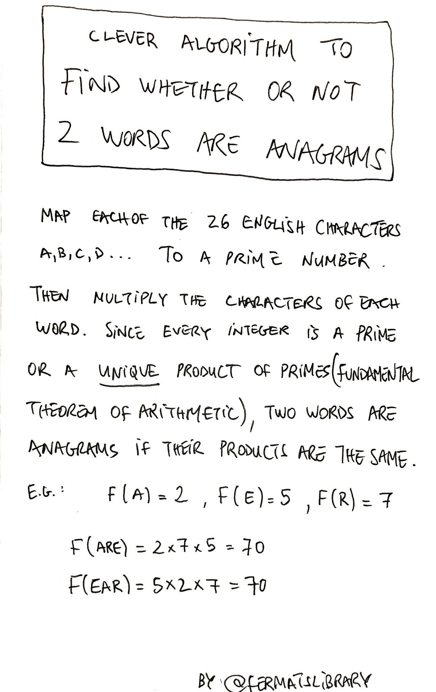

!!! info "_disclaimer_"

    Não espere encontrar algoritmos que vão salvar sua vida. Eu vou postar aqui algoritmos que acho interessante, mas isso não quer dizer que eles são poderosos ou que fazem coisas interessantes. Possivelmente sempre vai ser um algoritmo que faz uma coisa simples de que de um jeito complexo, mas interessante.

## Prólogo

Dias atrás eu estava entediado olhando o [twitter](https://twitter.com/home) da [biblioteca de Fermat](https://fermatslibrary.com/) (_Fermat's Library_) e me deparei com um antigo [tuíte](https://twitter.com/fermatslibrary/status/958700402647674880) que me chamou bastante atenção. Ele continha um "algoritmo inteligente para descobrir se duas palavras são ou não anagramas. Um anagrama é uma palavra ou frase formada reorganizando as letras de uma palavra ou frase diferente, normalmente usando todas as letras originais exatamente uma vez [@anagram2020wikipedia]. O tal algoritmo foi descrito a partir da Figura {#fig_algorithm}.



Que, em tradução livre,

!!! note "Algoritmo inteligente para descobrir se duas palavras são ou não anagramas"
    Mapei cada um dos 26 caracteres da lingua inglesa. A, B, C, D... para um número primo. Então, multiplique os caracteres de cada palavra. Como todo número inteiro é um número primo ou um produto único de primos (teorema fundamental da aritmética), duas palavras são anagramas se seus produtos forem os mesmos. Por exemplo. Considere que $F(\texttt{a}) = 2$, $F(\texttt{e}) = 5$ e $F(\texttt{r}) = 7$. Temos então, que

    \begin{align*}
    F(\texttt{are}) &= 2 \times 7 \times 5 = 70 \\
    F(\texttt{ear}) &= 5 \times 2 \times 7 = 70 \\
    \end{align*}

    By @fermatslibrary

Que convenhamos, é um algoritmo interessante, porém nada eficiente (conversaremos sobre sua complexidade computacional mais adiante). Todavia, eu resolvi implementá-lo usando (claro) Python. Parece simples, teriamos que (primeiro) converter cada palavra em seu correspondente produto de primos:

 1. mapear cada letra do alfabeto para um número primo
 2. substituir cada letra da palavra (ou frase) pelo correspondente primo
 3. multiplicar os números.

E, comparar os dois valores. Se forem iguais, são anagramas. Caso contrário não o são.

## Buscando uma solução elegante

Para mapear cada letra do alfabeto para um número primo, criaremos uma função `letter_to_prime` que recebe uma letra, encontra a posição dela no alfabeto e retorna o número primo correspondente. Em python,

```Python
letters = 'abcdefghijklmnopqrstuvwxyz'
primes = [
    2, 3, 5, 7, 11, 13, 17, 19, 23, 29, 31, 37, 41, 43,
    47, 53, 59, 61, 67, 71, 73, 79, 83, 89, 97, 101
]


def letter_to_prime(letter):
    return primes[letters.index(letter)]
```
Bem, seria uma saída, não a melhor, mas seria. Particularmente, eu não gostei de ter digitado todos os $26$ números primos que necessitava, queria algo que fizesse isso por mim (eu poderia ter digitado algum número errado).

### Geração de números primos

Lembrei então que conhecia uma fórmula pra gerar números primos. Ela funcionava de $0$ até $39$, eu só precisava que funcionasse de $0$ até $25$, então estava ótimo. A equação era a seguinte:

$$
P(n) = n^2 + n + 42. \label{eq_antiga}
$$

Dessa forma, eu poderia refatorar meu código para

```Python
letters = 'abcdefghijklmnopqrstuvwxyz'


def primes(n)
    return n**2 + n + 42


def letter_to_prime(letter):
    return primes(letters.index(letter))
```
É, gostei mais dessa versão, mas ainda não estava satisfeito. Resolvi então, pesquisar sobre fórmulas mais interessantes para geração de números primos e encontrei uma [página da wikipedia que trata especificamente sobre isso](https://en.wikipedia.org/wiki/Formula_for_primes). Lendo esta página, descobri o teorema de Green-Tao [@green2020wikipedia], em suma, o que ele diz é que existem progressões aritméticas iteiramente compostas por números primos.

!!! info "Info"
    Uma progressão aritmética é uma sequência numérica em que cada termo, a partir do segundo, é igual à soma do termo anterior com uma constante. Os Números primos são números naturais maiores do que 1 que possuem somente dois divisores, ou seja, são divisíveis por 1 e por ele mesmo.

Além disso, descobri que o resultado mais conhecido é uma progressão aritmética de $26$ números (exatamente o que precisava) [@formula2020wikipedia], gerada pela sequinte equação:

$$
L(n) = 43142746595714191 + 5283234035979900n. \label{eq_green_tao}
$$

Não sei você, mas eu gostei muito mais da segunda equação do da primeira. Além disso, parece que ela se encaixa perfeitamente com o que a gente precisa (apenas 26 números números primos). Vou mudar o código para que ele use a nova equação. Além disso, vou utilizar a biblioteca `string` para evitar de digitar algum caractere errado. Dessa forma, o código ficou:

```Python
from string import ascii_lowercase as letters


def primes(n):
    return 43142746595714191 + 5283234035979900*n


def letter_to_prime(letter):
    return primes(letters.index(letter))
```

Ótimo, achei uma função que me agradava. Agora só precisava resolver os pontos 2 e 3 (substituir cada letra pelo correspondente primo e multiplicar os números).


### Multiplicação de valores em uma cadeia

O ponto 2 poderia facilmente ser solucionado usando _list comprehensions_ e o ponto 3 poderia ser resolvido utilizando um `for`. Dessa forma, teriamos o seguinte código:

```Python
def word_to_prod(word):
    prime_numbers =  [letter_to_prime(letter) for letter in word]
    result = 1
    for prime in prime_numbers:
        result *= result
    return result
```

!!! info "Info"
    _list comprehensions_ é uma forma concisa de criar e manipular listas em Python

Tá, talvez eu seja difícil de agradar. Não fiquei nada satisfeito com esse código. Talvez pudesse usar uma função de uma biblioteca padrão do python. Pesquisei e encontrei duas formas alternativas ao código anterior. A primeira dela utiliza `reduce` e a segunda maneira utiliza um método `prod` da biblioteca `math`. Dessa forma, meu código pode ser refatorado para

```Python
from functools import reduce


def word_to_prod(word):
    prime_numbers =  [letter_to_prime(letter) for letter in word]
    return reduce(lambda x, y: x * y, prime_numbers)
```

ou

```Python
from math import prod


def word_to_prod(word):
    prime_numbers =  [letter_to_prime(letter) for letter in word]
    return prod(prime_numbers)
```

São soluções legais, mas eu não estava muito interessado em performace. Resolvi então tentar algo um pouco heterodoxo e usar recursão pra resolver os dois ponto de uma vez só. Como a função `letter_to_prime` só funciona para um elemento, eu poderia usar o caso base a cadeia ter tamanho $1$ e dividir a lista em dois pedaços. O primeiro com apenas um elemento e o segundo com o restante da cadeia. Multiplicaria esses dois valores (pasando pela função novamente) e _voilà_:

```Python
def word_to_prod(word):
    if len(word) == 1:
        return letter_to_prime(word)
    return word_to_prod(word[0]) * word_to_prod(word[1:])
```
Agora sim, me pareceu um código digno desse algoritmo.

## Solução final

Bem, agora eu poderia juntar tudo e adicionar também uma função para comparar se duas palavras são anagramas. Como dito anteriormente, só é necessário comparar os dois valores. Se forem iguais, são anagramas. Caso contrário não o são.

```Python
from string import ascii_lowercase as letters


def primes(n):
    return 43142746595714191 + 5283234035979900*n


def letter_to_prime(letter):
    return primes(letters.index(letter))


def word_to_prod(word):
    if len(word) == 1:
        return letter_to_prime(word)
    return word_to_prod(word[0]) * word_to_prod(word[1:])


def are_anagram(word_1, word_2):
    if word_to_prod(word_1) == word_to_prod(word_2):
        return True
    return False
```

Resolvi colocar a lógica da função `letter_to_prime` dentro da função `word_to_prod` e inserir uma linha de código para remover espaços entre as palavras e deixar tudo em _lowercase_, caso queira utilizar frases. O código final é:

```Python
from string import ascii_lowercase as letters


def primes(n):
    return 43142746595714191 + 5283234035979900*n


def word_to_prod(word):
    word = word.replace(' ', '').lower()
    if len(word) == 1:
        return primes(letters.index(word))
    return word_to_prod(word[0]) * word_to_prod(word[1:])


def are_anagram(word_1, word_2):
    if word_to_prod(word_1) == word_to_prod(word_2):
        return True
    return False
```

Agora sim, acho que está completo, então salvei então como `prime_anagrams.py`. Para testar é só importar e chamar a função `are_anagram`.


```Python
from prime_anagrams import are_anagram


print(are_anagram('silent', 'listen'))
print(are_anagram('foo', 'bar'))
print(are_anagram('William Shakespeare', 'I am a weakish speller'))
```

Bem, convenhamos, é uma solução engraçada. Computacionalmente falando ela é terrivel, mas foi divertido. Em falar em custo computacional, eu encontrei uma discurssão sobre o custo computacional dessa solução.

### Custo computacional
Segundo o [@xanilax2017Clever], usuário do [reddit](https://www.reddit.com/), considerando $n$ o comprimento das cadeias, o tempo de execução final acaba sendo $\mathcal{O}(n^2)$. Além disso, existe um algoritmo $\mathcal{O}(n + s)$ que se baseia em tornar uma matriz indexada pelas $s$ letras possíveis e, em seguida, verificar se as duas sequências têm a mesma contagem de cada letra.

## Outras soluções

Resolvi então procurar outras soluções pra testar se duas palavras (ou frases) são anagramas. Encontrei duas soluções simples e conhecidas para esse problema.

<figure markdown>

</figure>
### Usando ordenação

A primeira delas, seria ordenar as cadeias de caracteres e comparar se as cadeias ordenadas são iguais. Caso forem, é um anagrama. Em python isso seria

```Python
def are_anagram(word_1, word_2):
    word_1 = word_1.replace(' ', '').lower()
    word_2 = word_2.replace(' ', '').lower()

    if sorted(word_1) == sorted(word_2):
        return True
    return False
```

Considerando $n$, o tamanho das cadeias de caracteres, o custo computacional dessa solução é equivalente ao de uma ordenação $\mathcal{O}(n \log n)$.

### Usando contagem de caracteres

Outra solução seria (como mencionado por xanilax [@xanilax2017Clever]) tornar uma matriz indexada pelas $s$ letras possíveis e, em seguida, verificar se as duas sequências têm a mesma contagem de cada letra.

```Python
from collections import Counter


def are_anagram(word_1, word_2):
    word_1 = word_1.replace(' ', '').lower()
    word_2 = word_2.replace(' ', '').lower()

    if Counter(word_1) == Counter(word_2):
        return True
    return False
```
Considerando $n$, o tamanho das cadeias de caracteres, o custo computacional dessa solução é $\mathcal{O}(n + s)$.

## Conclusão

Bem, acho que é isso. Foi só um grande devaneio sobre números primos e anagramas. Tem dias que realmente estou entediado e depois de algumas horas nem sei mais onde fui parar.

Sobre as soluções apresentadas no final, tabém não sei se são as melhores alternativas, mas garanto que a utilizando números primos é a mais pomposa. Espero que tenha gostado da leitura.


<figure markdown>

</figure>

\bibliography
