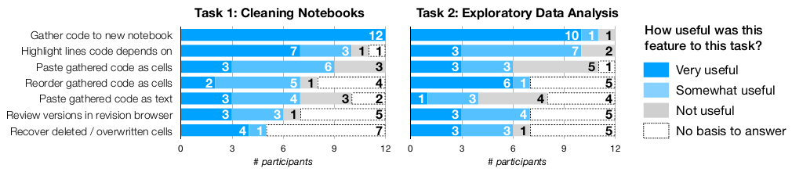

# Managing Messes in Computational Notebooks

!!! abstract "Abstract"

    Os cientistas de dados utilizam "programação exploratória" através de notebooks para escrever código, analizar, visualizar dados, testar hipóteses e criar modelos [@kery2017exploring]. No entanto, a medida que a análise avança, os notebooks tendem a se tornar desordenados, inconsistentes e a acomular "bagunças" [@kery2018story][@rule2018aiding].

    Em geral, existem três tipos de bagunças comuns aos notebooks: desordem, em que o intérprete executa o código em uma ordem diferente da apresentada nas células; exclusão, onde o usuário exclui ou substitui o conteúdo de uma célula, mas o intérprete retém o efeito do código da célula; e dispersão, onde o código que gera um resultado está espalhado por muitas células distantes.

    O artigo apresenta um conjunto de ferramentas de coleta de código que ajudam na limpeza, recuperação e comparação de código anteriores. Além disso, foi realizado um estudo qualitativo de usabilidade, que fornece informações sobre o uso e usabilidade das ferramentas desenvolvidas.

## Métodos
Foram realizadas entrevistas formativas com 8 cientistas de dados. Foram propostas diversas extensões ao modelo de interação com os notebooks. Foi apresentado maior entusiasmo por ferramentas para ajudar na limpeza de resultados e exploração de variantes passadas de código. As entrevistas e a revisão de literatura produziram ideias chave que orientaram no design da ferramente:

 - **Gerenciamento post-hoc de bagunças**: os analistas tem diversas preferências quanto a organização e gerenciamento de versões de código. A solução proposta foi a criação de ferramentas que coletam silenciosamente o histórico e fornecem acesso ao código que produziu qualquer resultado (variável, gráfico, etc).

 - **Portabilidade de código coletado**: os cientistas utilizam código no mesmo notebook, em notebooks diferentes ou mesmo em scripts separados. As ferramentas projetadas também facilitam a coleta de código para novos notebooks, células ou clipboard.

 - **Código de consulta através da seleção direta de resultados**: trabalhos anteriores mostraram que os cientistas frequentemente procuram a saida do programa ao procurar código para reutilizar. Dessa maneira, o mais recomendado é que as seleções de resultados forneceriam o método mais direto para acessar o histórico relevante.

### Implementação

Utilizando as ideias-chave comentadas anteriormente, foi desenvolvida uma ferramenta chamada gather, que consiste em um plugin para jupyter notebooks. Tal implementação suporta somente notebooks escritos em Python 3, mas os autores relatam que as especificações apresentadas no artigo ajudariam na construção de ferramentas semelhantes para notebooks com linguagens parecidas com python (Julia e R).

=== "Back-end"

    Quando um analista deseja utilizar o gather para coletar o código que produziu algum resultado, o back-end (1) divide o log de células executadas até a célula em que o analista clicou em um resultado e descarta as outras células. Depois disso ele (2) concatena o texto das células restantes em um único programa; (3) divide o programa usando as seleções do analista como critério de fatia; (4) combina as células fatiadas com os resultados selecionados se forem saídas de código e (5) exibe essas células em um notebook ou navegador de versão. A figura a seguir exemplifica o que foi dito:

=== "Front-end"

    Ao longo de uma longa análise, um (1) notebook ficará confuso e inconsistente. Com o gather, um analista pode (2) selecionar resultados (por exemplo, gráficos, tabelas, definições de variáveis e qualquer outra saída de código) e clicar em (3) gather to "notebook" (ou clipboard, revisions) para obter uma fatia mínima, completa e ordenada que replica os resultados selecionados.

### Estudo de usabilidade (_in-lab_)

200 participantes foram selecionados aleatoriamente, mas apenas 12 estavam aptos e/ou responderam ao convite de participação do experimento, que consistia em uma sessão de duas horas em laboratório para execução de duas tarefas, uma delas de limpeza de notebook e outra de análise exploratória. Os participantes foram observados e, ao final da sessão, responderam questionários ao final de cada tarefa.

## Resultados
!!! success ""

    Os analistas consideraram o gather mais util em coletar código para novos notebooks, quando executavam a tarefa de limpeza e quando executavam análises exploratórias. Além disso, os analistas também apreciaram os destaques da dependência, especialmente quando estavam limpando o código.

    <figure markdown>
    { align=center }
    <figcaption>Me and Fisher, my cat.</figcaption>
    </figure>

### Limitações

!!! failure ""

    Duas limitações ficaram claras: (1) os participantes não fizeram seu próprio trabalho, com seus próprios dados; (2) curta duração do estudo, que acreditasse ser responsável pelo baixo uso do recurso de navegador de versão.

## Conclusões
Os participantes responderam positivamente as ferramentas do gather, principalmente a que produz automaticamente o código mínimo necessário para replicar um conjunto escolhido de resultados de análise. Além disso, os analistas usaram principalmente o gather como um "movimento final" para compartilhar o trabalho. Por fim, os analistas também encontraram usos imprevistos, como gerar material de referência, criar ramificações leves em seu código e criar resumos para vários públicos.

<!-- [^1]: Manter as células ordenadas para que eles sempre reproduzam os resultados visíveis, copiar trechos úteis para arquivos externos, atribuir novos nomes às variáveis ​​do conjunto de dados sempre que as transformam, evitando sobrescrever os dados originais.
[^2]: Os analistas entrevistados queriam ferramentas para ajudá-los na reutilização de código em novos notebooks, aplicar análises de novos notebooks em notebooks antigos e exportar código para outros arquivos. -->

\bibliography
