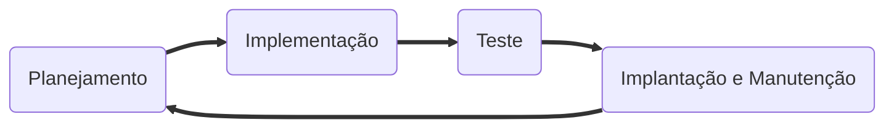
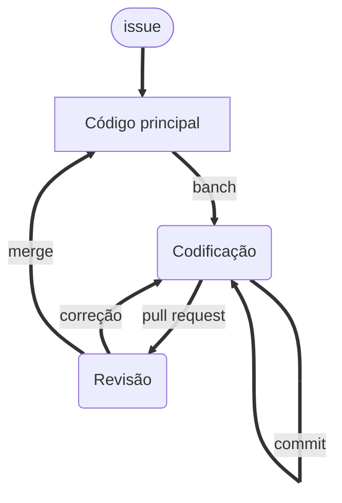

# Ciclo de desenvolvimento de software

Independente do tipo, para iniciar um projeto que envolve desenvolvimento de software com qualidade é necessário que alguns protocolos sejam seguidos. Nesse artigo eu tento citar o fluxo de trabalho que utilizo no desenvolvimento dos meus projetos pessoais de software. Além disso, apresento as ferramentas que utilizo em cada uma das etapas.

!!! info "Notas"

    - Artigo destinado a pessoas com o conhecimento mínimo em ferramentas de controle de versão.
    - Alguns termos são apresentados em inglês quando não encontradas palavras adequadas para tradução.
    - Como trata-se do desenvolvimento de software, a criação do repositório de código não será mencionada, sendo o passo 0 do ciclo apresentado.

Na Figura 1 é apresentada uma visão geral do fluxo que uso no desenvolvimento de software. Abaixo serão descritos cada um desses passos.

<figure markdown>

<caption>**Figura 1**: Ciclo de vida do desenvolvimento de software.</caption>
</figure>

<!-- ## :fontawesome-regular-lightbulb: Ideia -->

## :material-clipboard-edit-outline: Planejamento

Todo projeto começa com a ideia, que é desenvolvida por meio de discussões e pesquisas. Nesse ponto devem estar envolvidos todos os interessados com o projeto (quando possível), desde os usuários até a equipe de desenvolvimento, passando pela equipe de design. Ou, só você mesmo, caso seja o desenvolvimento solitário. Nessa etapa tudo deverá ser anotado, desenhado e descrito. Você pode precisar de uma ferramenta de criação de mapas mentais e diagramas, além de um sistema de comunicação.

Depois de definir uma ideia geral, ela será dividida em várias ideias menores, contendo "problemas", ou _issues_, que precisam ser resolvidas. Uma _issue_ pode ser, por exemplo, uma funcionalidade do software ou mesmo parte dela.

Com um conjunto de _issues_ em mãos, devemos organizá-las em _milestones_ (marcos) e _releases_ (lançamentos) de acordo com a prioridade, necessidade e dificuldade. Tal divisão nos ajudará a definir o que irá ser realizado primeiro.

!!! note "Ferramentas"

    - **[whimsical](https://whimsical.com/){target=_blank}**: Criação de diagramas.
    - **[Github](http://github.com/){target=_blank}**: Hospedagem do repositório e criação de issues.

<!-- O [github](https://github.com/){target=_blank} também oferece uma ferramenta que permite criação de quadros Kanban. Você pode fazer isso através da criação de projetos. Dessa forma, podemos ter controle do que está sendo feito, qual etapa está, bem como o responsável pela tarefa. -->

## :fontawesome-solid-code: Implementação

Esta é a etapa real de resolução das _issues_. Nela será realizada a codificação e a revisão do código gerado.  Nessa etapa geralmente são utilizados um ambiente de desenvolvimento e uma ferramenta de controle de versão (geralmente o git).

Quando a resolução da mesma requer o desenvolvimento de software, precisamos criar a funcionalidade requerida através da escrita de código, bem como de testes e documentação. Além disso, somente a utilização do git não resolverá o problema de controle de versão e trabalho em grupo, devemos adotar um padrão de fluxo de ramificações. O padrão mais utilizado atualmente é o [gitflow](https://www.atlassian.com/git/tutorials/comparing-workflows/gitflow-workflow){target=_blank}. No entanto, podemos utilizar versões mais simplificadas, como o [github workflow](https://docs.github.com/en/get-started/quickstart/github-flow){target=_blank}. Na Figura 2 é apresentado o detalhamento da etapa de implementação.

<figure markdown>

<caption>**Figura 2**: Etapa de implementação.</caption>
</figure>

Para cada _issue_, você deverá criar uma _branch_, que guardará uma cópia do código principal do software naquele momento. Cada modificação inserida será guardada através da criação de um _commit_. Depois de ter codificado o suficiente para dar como encerrada a _issue_, você deverá efetuar um _pull-request_. Nesse ponto, o código é enviado para uma equipe responsável pela realização de uma série de testes e análises, para confirmação da resolução da _issue_ ou mesmo requisição de correções. Quando forem requisitadas correções, voltaremos a codificação, efetuaremos as modificações necessárias e retornaremos a revisão. Quando tudo estiver funcionando como deveria, é hora de inserir as modificações no código principal através do _merge_.

Nesta etapa também precisaremos utilizar uma ferramenta para monitorar a resolução das issues. Uma ótima ferramenta são quadros Kaban. Para o uso em desenvolvimento de software, geralmente tal quadro contém as seguintes etapas:

 - :material-clipboard-edit-outline: **To do**: _issues_ que ainda entrarão em processo de desenvolvimento.
 - :fontawesome-solid-code-branch: **In progress**: _issues_ que já entraram em processo de desenvolvimento, ou seja, existe alguém codificando ou realizando tal tarefa.
 - :fontawesome-solid-code-pull-request: **Review in progress**: depois que a _issue_ foi resolvida, é enviada para uma equipe, responsável pela realização de uma série de testes e análises, para confirmação da resolução da issue.
 - :material-clipboard-check-multiple: **Review approved**: após a verificação da resolução da _issue_, os revisores podem aprovar a tarefa. Desse modo, o código poderá ser anexado ao código principal, no repositório central.
 - :fontawesome-solid-code-merge: **Done**: uma vez que o código foi anexado ao código principal, podemos dar como resolvida aquela _issue_.

!!! note "Ferramentas"

    - **[Visual Studio Code](https://code.visualstudio.com/){target=_blank}**: Ambiente de desenvolvimento.
    - **[Jupyter Lab](https://jupyter.org/install)**: Ambiente de desenvolvimento para projetos de ciência de dados.
    - **[Git](https://git-scm.com/)**: Sistema de controle de versão.
    - **[Github](http://github.com/){target=_blank}**: Criação de quadro Kanban através da área de projetos.
    - **[gitflow](https://www.atlassian.com/git/tutorials/comparing-workflows/gitflow-workflow){target=_blank}**: Padrão geral para fluxo de ramificações.
    - **[github workflow](https://docs.github.com/en/get-started/quickstart/github-flow){target=_blank}**: Variação do gitflow.

## :fontawesome-solid-list-check: Teste

Para tornar o código estável e robusto, torna-se necessária a execução de testes. Nesta etapa os defeitos do produto são relatados, rastreados, corrigidos e retestados, até que o produto atinja os padrões de qualidade definidos. Cada linguagem tem suas ferramentas especiais aqui e você também pode utilizar ferramentas de integração contínua para automatizar parte desta tarefa.

## :material-truck-delivery-outline: Implantação e manutenção

Uma vez que o produto esteja testado e pronto para ser implantado, ele é lançado formalmente. Geralmente, a implantação do produto acontece em etapas de acordo com a estratégia de negócios dessa organização. O produto pode ser lançado primeiro em um segmento limitado e testado no ambiente real de negócios. Em seguida, com base no feedback, o produto pode ser lançado como está ou com melhorias sugeridas no segmento de mercado-alvo.

Após o lançamento do produto, é feita sua manutenção. Esse é o momento de olhar para trás e verificar qual etapa do trabalho precisa ser melhorada.

Assim como a etapa de teste, existem ferramentas dependendo da linguagem e nesse caso também pode-se automatizar essa tarefa.

*[Kanban]: O termo "Kanban" é de origem japonesa e significa "sinalização" ou "cartão", e propõe o uso de cartões (post-its) para indicar e acompanhar o andamento da produção dentro da indústria.
