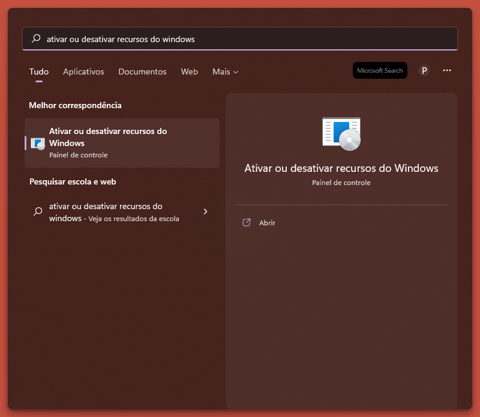
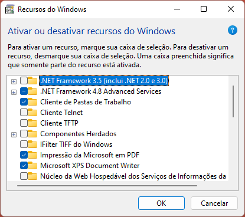
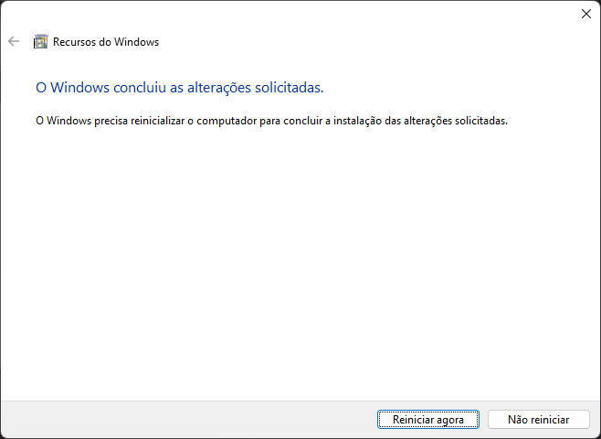
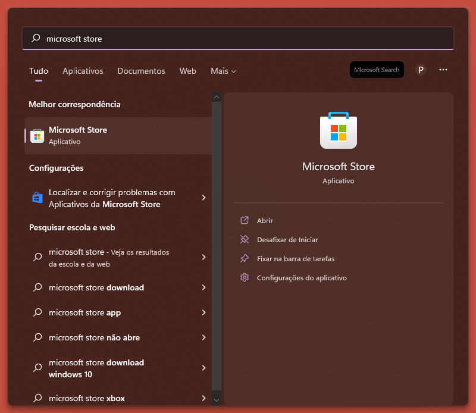
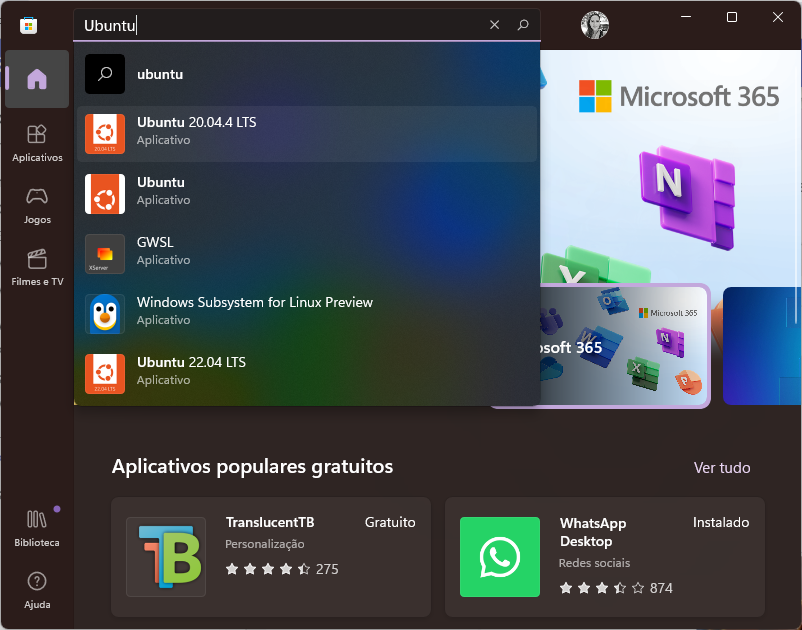
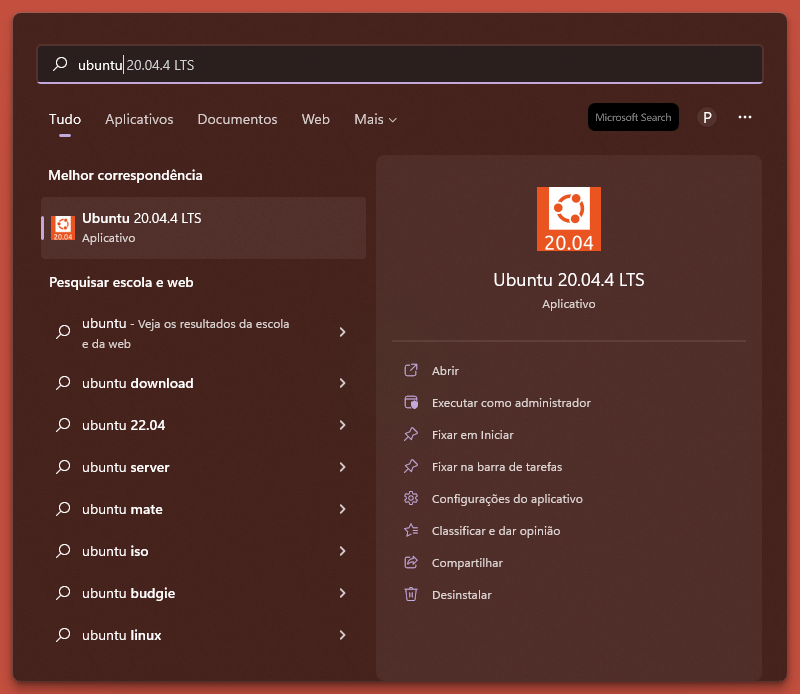
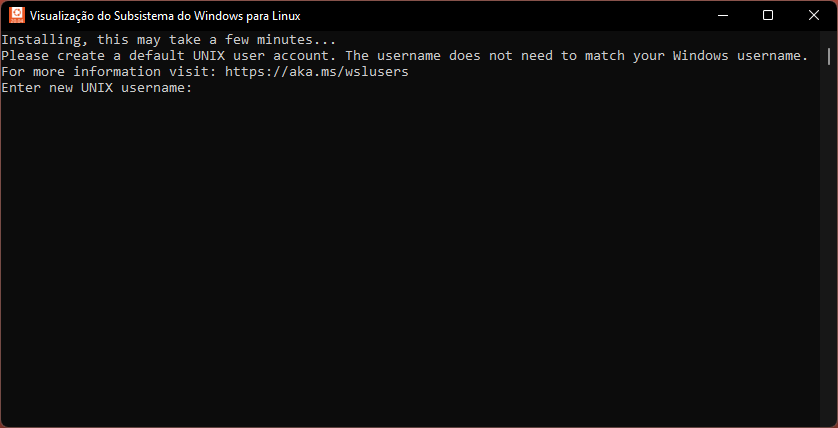

# Preparação de um ambiente de desenvolvimento Python

## Introdução

Ao aprender uma linguagem de programação, o foco é essencialmente entender a sintaxe, o estilo de código e os conceitos subjacentes. Com o tempo, você se torna suficientemente confortável com a linguagem e começa a escrever programas que resolvem problemas realmente interessantes. No entanto, para avançar para essa etapa, há um aspecto que pode ser subestimado que é **como construir o ambiente certo**. Um ambiente que impõe boas práticas de engenharia de software, melhora a produtividade e facilita a colaboração.

Outra característica importante é que este ambiente suporte o trabalho simultãneo em vários projetos, utilizando diferentes linguagens de programação e versões das mesmas. Além de bibliotecas e ferramentas específicas para cada um dos projetos. Para que um projeto não interfira em outro, eles devem ser isolados de alguma forma.

Quando se trata da linguagem Python, vários projetos de código aberto surgiram nos últimos anos e visam facilitar o gerenciamento de **versões**, **dependências** e **ambientes virtuais**.

<figure markdown>
  {width=100%}
  <caption>Fonte: [xkcd/1987](https://xkcd.com/1987/).</caption>
</figure>

Afim de criar um ambiente que facilite a colaboração, imponha boas práticas, melhore a produtividade e facilite a colaboração, utilizaremos as seguintes ferramentas:

 - `ubuntu`: ambiente mais próximo de ambientes de produção;
 - `pyenv`: gerencia diferentes versões do Python na mesma máquina;
 - `poetry`: gerencia ambientes virtuais e as dependências de tais ambientes;
 - `git`: sistema colaborativo e descentralizado de controle de versões.

Vamos então seguir os seguintes passos:

 1. Instalar o `Ubuntu 20.04`;
 2. Instalar o `pyenv`;
 3. Instalar o `poetry`;
 4. Configurar o `git`.

!!! note "Nota"
    A instalação do ambiente dependerá do seu sistema operacional. Caso o seu sistema operacional seja o Windows, siga todos os passos. Caso use o sistema operacional Linux ou Mac, inicie da seção [Instalar o `pyenv`](#2-instalar-o-pyenv).

## 1. Instalar Ubuntu 20.04

### Ativar recursos do Windows

Iniciaremos ativando os recursos do Windows necessários para preparação do ambiente. Para isto, vá até o menu **iniciar** e pesquise por "Ativar ou desativar recursos do Windows" (*Turn windows features*). Depois disso, clique na opção em destaque, como mostrado na imagem abaixo:

<figure markdown>
  
</figure>

Aparecerá a janela de ativação e desativação  de recursos do windows, como mostrado abaixo:

<figure markdown>
  
</figure>

Você precisará marcar as seguintes opções:

 - Plataforma do Hipervisor do Windows (*Hiper-V*)
 - Plataforma de Máquina virtual (*Virtual Machine Platform*)
 - Subsistema do Windows para linux (*Windows subsystem for Linux*)

Com as opções selecionadas, clique no botão **OK**. Depois que as alterações forem concluídas, será solicitado o reinicio da máquina.

<figure markdown>
  
</figure>

Clique no botão **Reiniciar agora**.

### Instalar Ubuntu 20.04

Após reiniciar o computador, vá novamente até o menu **iniciar** e pesquise por "microsoft store". Depois disso, clique na opção em destaque:



Aparecerá a janela da loja de aplicativos (*microsoft store*). Na barra de pesquisa, procure por "Ubuntu" e selecione a opção "Ubuntu 20.04.4 LTS":



Depois disso, clique no botão **Adquirir** (*get*) e aguarde a instalação.

### Iniciar o Ubuntu

Para iniciar o Ubuntu, vá novamente até o menu **iniciar** e pesquise por "Ubuntu". Clique na opção em destaque.



Aguarde as configurações serem finalizadas. Neste momento, será solicitado um novo nome de **usuário** e uma nova **senha** para o Ubuntu.



!!! tip "Dica"

    Ao digitar a senha, nada aparecerá. Não se preocupe, pois este é um recurso de segurança que não exibe os caracteres digitados.

Pronto! Agora você já pode utilizar o Ubuntu instalado na sua máquina.

!!! info "Info"

    Caso você encontre o erro `0x800701bc`, acesse [este link](https://wslstorestorage.blob.core.windows.net/wslblob/wsl_update_x64.msi) para atualizar a versão do `wsl` instalada na sua máquina. Depois disso, tente abrir o Ubuntu novamente.

## 2. Instalar o `pyenv`

Antes de instalar o `pyenv`, iremos configurar o comando de chamada do Python. Por padrão, o **Ubuntu 20.04** vem com o comando `python3`, mas para facilitar, iremos instalar uma aplicação que cria um link simbólico entre o comando `python` e o comando `python3`, através do seguinte comando:

```
sudo apt install python-is-python3
```

Agora podemos utilizar o comando python normalmente. Tente usar

```
python -V
```


Vamos iniciar clonando o repositório do pyenv:

```
git clone https://github.com/pyenv/pyenv.git ~/.pyenv
```

Depois disso, execute os seguintes comandos para configuração do bash:

```
echo 'export PYENV_ROOT="$HOME/.pyenv"' >> ~/.bashrc
echo 'command -v pyenv >/dev/null || export PATH="$PYENV_ROOT/bin:$PATH"' >> ~/.bashrc
echo 'eval "$(pyenv init -)"' >> ~/.bashrc
```

Por fim, iremos reiniciar o `SHELL`:

```
exec "$SHELL"
```

Depois desse comando feche o Ubuntu e abra novamente.

### Instalar dependências de build do `pyenv`

Para que o pyenv funcione perfeitamente, você precisa instalar as dependências de build, necessárias para compilar as versões do python. Utilize o seguinte comando:

```
sudo apt-get update; sudo apt-get install make build-essential libssl-dev zlib1g-dev libbz2-dev libreadline-dev libsqlite3-dev wget curl llvm libncursesw5-dev xz-utils tk-dev libxml2-dev libxmlsec1-dev libffi-dev liblzma-dev
```

### Instalar o `python` 3.8.10

Agora podemos instalar versões do python. Antes de tudo, pode verificar quais versões tem instalada com o comando pyenv versions. Você verá somente a versão do sistema. No entanto, precisamos instalar a versão 3.8.10. Para tal, utilize o seguinte comando:

```
pyenv install 3.8.10
```

Prontinho, agora precisamos mudar para versão instalada utilizando o comando:

```
pyenv global 3.8.10
```

Para verificar se a seleção ocorreu de maneira correta, utilize o comando:

```
pyenv versions
```
A saída deste comando deverá mostrar qual versão do python está selecionada como global.

## 3. Instalar o `poetry`

Para realizar a gestão de dependências e ambientes virtuais precisamos instalar o Poetry. Fazemos isso através do seguinte comando:

```
curl -sSL https://install.python-poetry.org | python -
```

Depois disso, precisamos colocar o `poetry` no `path` usando o seguinte comando:

```
echo 'export PATH="$HOME/.poetry/bin:$PATH"' >> ~/.bashrc
```

Você precisará fechar e abrir o Ubuntu para seguir para o próximo passo. Antes de continuar, verifique se o `poetry` foi instalado corretamente, digitando o comando

```
poetry
```

A saída deste comando é o manual de uso da ferramenta. Caso tudo ocorra bem, prossiga para o próximo passo.

## 4. Configurar o `git`

### Identidade
Por padrão, o Ubuntu 20.04 vem com o `git` instalado. Desse modo, precisamos apenas realizar a configuração de identidade. Isto é necessário para que cada _commit_ seja identificado de maneira correta. Para realizar a configuração utilize o seguinte comando, substituindo `Fulano de Tal` pelo seu nome e sobrenome:

```
git config --global user.name "Fulano de Tal"
```
Depois disso, configure o seu email através do seguinte comando, substituindo `fulanodetal@exemplo.br` pelo seu email:

```
git config --global user.email fulanodetal@exemplo.br
```

!!! tip "Dica"

    Caso erre a configuração, não se preocupe, pois você poderá inseri-la novamente apertando a tecla de movimentação para cima e corrigindo as informações.


### SSH

#### Gerar chave SSH

Além da configuração de identidade, é necessário efetuar geração de chave SSH e adicioná-la ao github. Para isto, abra o terminal e digite o seguinte comando, substituindo o endereço de e-mail pelo seu Github.

```
ssh-keygen -t ed25519 -C "fulanodetal@exemplo.br"
```
Isto cria uma nova chave SSH, usando o nome de e-mail fornecido como uma etiqueta.

Quando aparecer a solicitação "**Enter file in which to save the key**", pressione ++enter++. O local padrão do arquivo será aceito.

Também será requisitado uma senha para uso da credencial SSH. Caso não queira inserir, apenas aperte ++enter++.


#### Adicionar chave SSH ao Github

Após gerar um par de chaves SSH (uma pública e uma privada), você deve adicionar a chave pública no `github` para habilitar o acesso SSH para a sua conta.

Vá até o Ubuntu e utilize o seguinte comando para mostrar o conteúdo da chave SSH criada anteriormente:

```
cat ~/.ssh/id_ed25519.pub
```

Selecione o texto de saída do comando e copie para área de transferência.

Agora iremos inserir a chave copiada no `github`. Para isso, abra o [github.com](https://github.com/), clique na sua foto de perfil e, em seguida, clique em **Settings**:

<p align="center">

</p>

Na seção **Access**, da *sidebar*, clique em **SSH and GPG keys**.

Clique em **New SSH key** (Nova chave SSH) ou **Add SSH key** (Adicionar chave SSH):


No campo **Title**, adicione uma etiqueta descritiva para nova chave.

Cole sua chave no campo **Key**:


Clique em **Add SSH key** (adicionar chave SSH). Se solicitado, confirme sua senha do `github`.

## Conclusão

Se tudo ocorreu bem, finalizamos a nossa jornada de preparação do ambiente. Agora você está preparado para construir e colaborar com projetos Python de maneira produtiva e eficiente. O próximo passo é criar um repositório a partir do [seguinte template](https://git.io/ds-template), que será utilizado ao longo do curso, e efetuar o clone na sua máquina. Se você tem dúvidas de como criar repositórios a partir de templates, acesse a [documentação oficial](https://docs.github.com/pt/repositories/creating-and-managing-repositories/creating-a-repository-from-a-template) do github.

!!! info "Referências"
    1. [Managing Version, Virtual Environments and Dependencies with Pyenv and Poetry](https://blog.pronus.io/en/posts/python/gerenciamento-de-versoes-ambiente-virtuais-e-dependencias-com-pyenv-e-poetry/)
    2. [Poetry - Python dependency management and packaging made easy.](https://python-poetry.org/docs/)
    3. [Simple Python Version Management: pyenv](https://github.com/pyenv/pyenv)
    4. [Começando - Configuração inicial do Git](https://git-scm.com/book/pt-br/v2/Come%C3%A7ando-Configura%C3%A7%C3%A3o-Inicial-do-Git)
    5. [Gerar uma nova chave SSH e adicioná-la ao ssh-agent](https://docs.github.com/pt/authentication/connecting-to-github-with-ssh/generating-a-new-ssh-key-and-adding-it-to-the-ssh-agent)
    6. [Adicionar uma nova chave SSH à sua conta do GitHub](https://docs.github.com/pt/authentication/connecting-to-github-with-ssh/adding-a-new-ssh-key-to-your-github-account)
