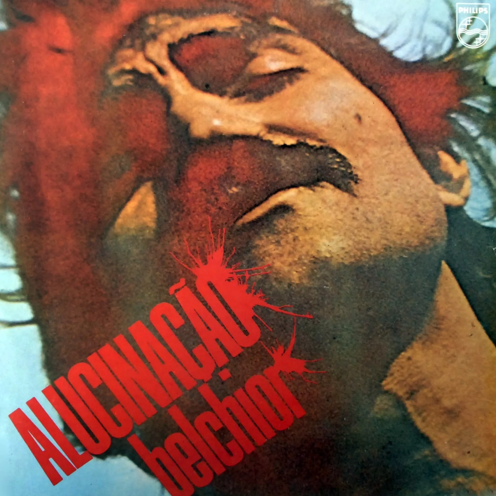

# Belchior - Alucinação (1976)

## Ficha técnica

{width=30%, align=right}

 - **Artista**: Belchior
 - **Álbum**: Alucinação
 - **Ano**: 1976
 - **Gêneros**: MPB, Blues, Country, Baião, Rock
 - **Duração**: 00:37:32
 - **Gravadora**: PolyGram
 - **Produção**: Marco Mazzola

## Faixas

| Nº|	Título	| Duração | Estado | Letra |
|:---:|:---|:---|:---|:---:|
| A1 |	Apenas um Rapaz Latino-Americano  	| 4:17 | :fontawesome-solid-star: | [:octicons-note-16:](https://www.letras.mus.br/belchior/44449/){target="_blank"} |
| A2 |	Velha Roupa Colorida  	| 4:49 | :fontawesome-solid-star: | [:octicons-note-16:](https://www.letras.mus.br/belchior/44464/){target="_blank"} |
| A3 |	Como Nossos Pais  	| 4:41 | :fontawesome-solid-star: | [:octicons-note-16:](https://www.letras.mus.br/belchior/44451/){target="_blank"} |
| A4 |	Sujeito de Sorte  	| 3:56 | :fontawesome-solid-star: | [:octicons-note-16:](https://www.letras.mus.br/belchior/344922){target="_blank"} |
| A5 |	Como o Diabo Gosta  	| 2:33 | :fontawesome-solid-star: | [:octicons-note-16:](https://www.letras.mus.br/belchior/344908/){target="_blank"} |
| B1 |	Alucinação  	| 4:52 | :fontawesome-solid-star: | [:octicons-note-16:](https://www.letras.mus.br/belchior/153384/){target="_blank"} |
| B2 |	Não Leve Flores  	| 4:11 | :fontawesome-solid-star: | [:octicons-note-16:](https://www.letras.mus.br/belchior/344914/){target="_blank"} |
| B3 |	À Palo Seco  	| 2:56 | :fontawesome-solid-star: | [:octicons-note-16:](https://www.letras.mus.br/belchior/44448/){target="_blank"} |
| B4 |	Fotografia 3x4  	| 5:27 | :fontawesome-solid-star: | [:octicons-note-16:](https://www.letras.mus.br/belchior/132598/){target="_blank"} |
| B5 |	Antes do Fim  	| 0:59 | :fontawesome-solid-star: | [:octicons-note-16:](https://www.letras.mus.br/belchior/344901/){target="_blank"} |
