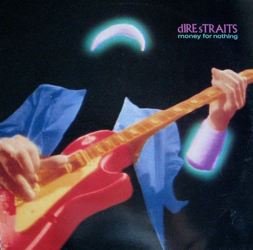

# Dire Straits - Money for Nothing (1988)

## Ficha técnica

{width=30%, align=right}

 - **Artista**: Dire Straits
 - **Álbum**: Money for nothing
 - **Ano**: 1988
 - **Gêneros**: Blues Rock, Folk Rock, Pop Rock
 - **Duração**: 00:54:14
 - **Gravadora**: Phonogram
 - **Produção**: Mark Knopfler

## Faixas

| Nº|	Título	| Duração | Letra |
|:---:|:---|:---|:---:|
| A1 | Sultans of Swing | 5:46 | [:octicons-note-16:](https://www.letras.mus.br/dire-straits/11024/#album:money-for-nothing-2002){target="_blank"} |
| A2 | Down to the Waterline | 4:00 | [:octicons-note-16:](https://www.letras.mus.br/dire-straits/11049/#album:money-for-nothing-2002){target="_blank"} |
| A3 | Portobello Belle (live) | 4:33 | [:octicons-note-16:](https://www.letras.mus.br/dire-straits/95154/#album:money-for-nothing-2002){target="_blank"} |
| A4 | Twisting by the Pool (Remix) | 3:30 | [:octicons-note-16:](https://www.letras.mus.br/dire-straits/75043/#album:money-for-nothing-2002){target="_blank"} |
| A5 | Romeo and Juliet | 5:57 | [:octicons-note-16:](https://www.letras.mus.br/dire-straits/11032/#album:money-for-nothing-2002){target="_blank"} |
| A6 | Where Do You Think You're Going? | 3:31 | [:octicons-note-16:](https://www.letras.mus.br/dire-straits/11039/#album:money-for-nothing-2002){target="_blank"} |
| B1 | Walk of Life | 4:07 | [:octicons-note-16:](https://www.letras.mus.br/dire-straits/11030/#album:money-for-nothing-2002){target="_blank"} |
| B2 | Private Investigations | 5:48 | [:octicons-note-16:](https://www.letras.mus.br/dire-straits/11044/#album:money-for-nothing-2002){target="_blank"} |
| B3 | Money for Nothing | 4:05 | [:octicons-note-16:](https://www.letras.mus.br/dire-straits/11036/#album:money-for-nothing-2002){target="_blank"} |
| B4 | Tunnel of Love | 8:09 | [:octicons-note-16:](https://www.letras.mus.br/dire-straits/63100/#album:money-for-nothing-2002){target="_blank"} |
| B5 | Brothers in Arms | 4:48 | [:octicons-note-16:](https://www.letras.mus.br/dire-straits/11027/#album:money-for-nothing-2002){target="_blank"} |
