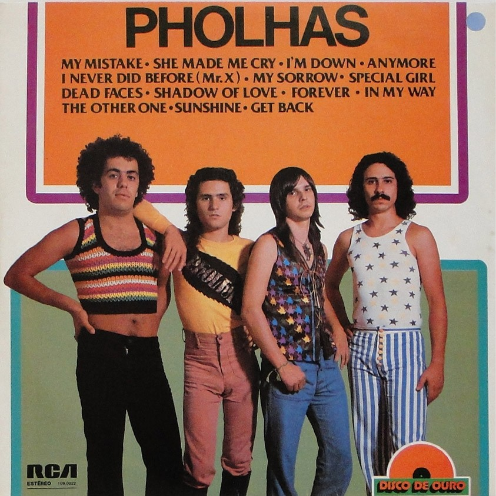

# Pholhas - Disco de Ouro (1977)

## Ficha técnica

{width=30%, align=right}

 - **Artista**: Pholhas
 - **Álbum**: Disco de Ouro
 - **Ano**: 1977
 - **Gêneros**: Rock, Pop
 - **Duração**: 00:44:12
 - **Gravadora**: RCA
 - **Produção**: -

## Faixas

| Nº|	Título	| Duração | Estado | Letra |
|:---:|:---|:---|:---|:---:|
| A1 | My Mistake | 3:07 | :fontawesome-solid-star: | [:octicons-note-16:](https://www.letras.mus.br/pholhas/66590/){target="_blank"}|
| A2 | Forever | 3:26 | :fontawesome-solid-star: | [:octicons-note-16:](https://www.letras.mus.br/pholhas/66600/){target="_blank"}|
| A3 | The Other One | 3:12 | :fontawesome-solid-star: | [:octicons-note-16:](https://www.letras.mus.br/pholhas/66594/){target="_blank"}|
| A4 | I'm Down | 3:28 | :fontawesome-solid-star: | [:octicons-note-16:](https://www.letras.mus.br/pholhas/im-down/){target="_blank"}|
| A5 | Shadow Of Love | 3:22 | :fontawesome-solid-star: | [:octicons-note-16:](https://www.letras.mus.br/pholhas/1513125/){target="_blank"}|
| A6 | My Sorrow | 3:10 | :fontawesome-solid-star: | [:octicons-note-16:](https://www.letras.mus.br/pholhas/66596/){target="_blank"}|
| A7 | In My Way | 3:28 | :fontawesome-solid-star: | [:octicons-note-16:](https://www.letras.mus.br/pholhas/66597/){target="_blank"}|
| B1 | She Made Me Cry | 3:15 | :fontawesome-solid-star: | [:octicons-note-16:](https://www.letras.mus.br/pholhas/66591/){target="_blank"}|
| B2 | I Never Did Before (Mr. X) | 2:53 | :fontawesome-solid-star: | [:octicons-note-16:](https://www.letras.mus.br/pholhas/66598/){target="_blank"}|
| B3 | Anymore | 2:44 | :fontawesome-solid-star: | [:octicons-note-16:](https://www.letras.mus.br/pholhas/1857326/){target="_blank"}|
| B4 | Special Girl | 3:10 | :fontawesome-solid-star: | [:octicons-note-16:](https://www.letras.mus.br/pholhas/1075144/){target="_blank"}|
| B5 | Sunshine | 4:20 | :fontawesome-solid-star: | [:octicons-note-16:](https://www.letras.mus.br/pholhas/1554238/){target="_blank"}|
| B6 | Get Back | 2:37 | :fontawesome-solid-star: | [:octicons-note-16:](https://www.letras.mus.br/pholhas/66599/){target="_blank"}|
| B7 | Dead Faces | 2:00 | :fontawesome-solid-star: | [:octicons-note-16:](https://www.letras.mus.br/pholhas/66601/){target="_blank"}|
