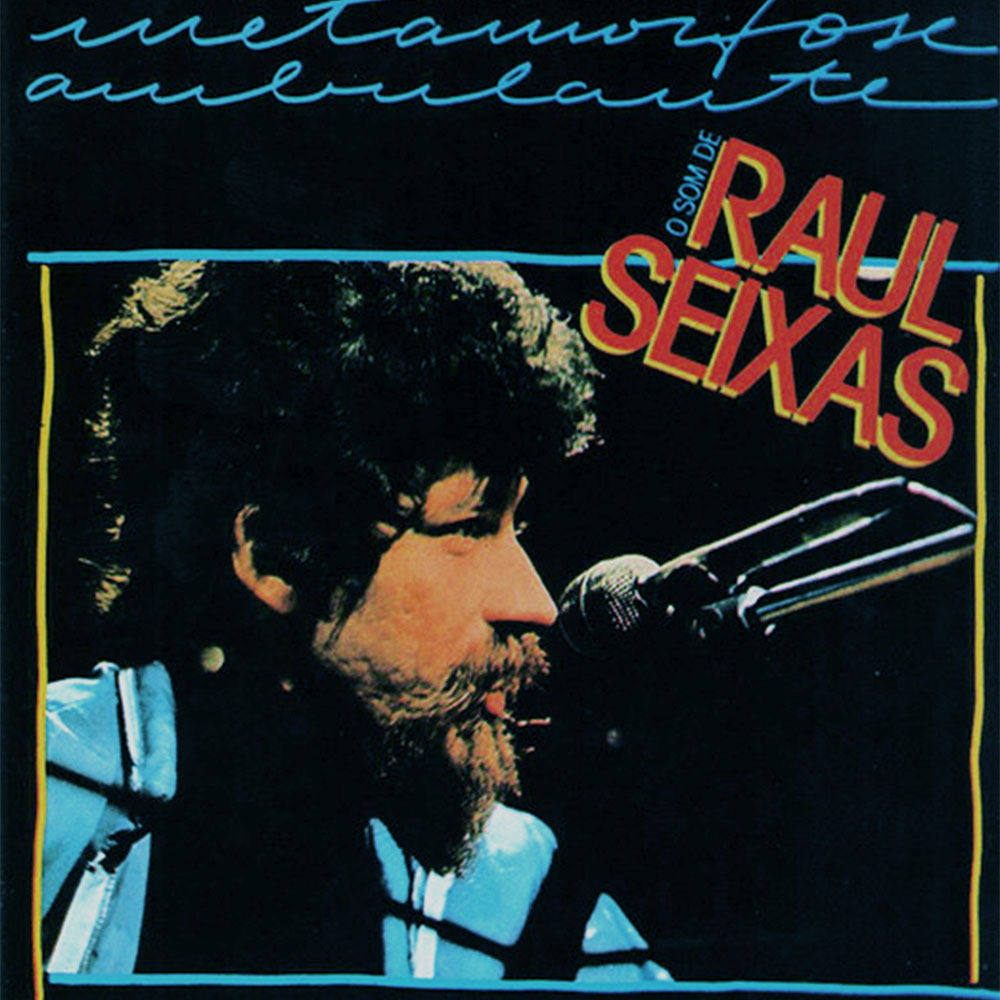

# Raul Seixas - Metamorfose Ambulante (1988)

## Ficha técnica

{width=30%, align=right}

 - **Artista**: Raul Seixas
 - **Álbum**: Metamorfose Ambulante
 - **Ano**: 1988
 - **Gêneros**: Rock, Blues, Folk, World, & Country
 - **Duração**: 00:36:42
 - **Gravadora**: Polygram
 - **Produção**: -

## Faixas

| Nº|	Título	| Duração | Estado | Letra |
|:---:|:---|:---|:---|:---:|
| A1 | Ouro De Tolo | 2:52 | :fontawesome-solid-star: | [:octicons-note-16:](https://www.letras.mus.br/raul-seixas/48326/){target="_blank"}|
| A2 | Eu Nasci Há 10 Mil Anos Atrás | 4:51 | :fontawesome-solid-star: | [:octicons-note-16:](https://www.letras.mus.br/raul-seixas/48309/){target="_blank"}|
| A3 | Mosca Na Sopa | 3:59 | :fontawesome-solid-star: | [:octicons-note-16:](https://www.letras.mus.br/raul-seixas/48320/){target="_blank"}|
| A4 | S.O.S | 3:07 | :fontawesome-solid-star: | [:octicons-note-16:](https://www.letras.mus.br/raul-seixas/198140/){target="_blank"}|
| A5 | Eu Também Vou Reclamar | 3:23 | :fontawesome-solid-star: | [:octicons-note-16:](https://www.letras.mus.br/raul-seixas/48311/){target="_blank"}|
| B1 | Gitã | 2:22 | :fontawesome-solid-star-half-stroke: | [:octicons-note-16:](https://www.letras.mus.br/raul-seixas/48312/){target="_blank"}|
| B2 | Tente Outra Vez | 4:51 | :fontawesome-regular-star: | [:octicons-note-16:](https://www.letras.mus.br/raul-seixas/48334/){target="_blank"}|
| B3 | Metamorfose Ambulante | 3:49 | :fontawesome-solid-star: | [:octicons-note-16:](https://www.letras.mus.br/raul-seixas/48317/){target="_blank"}|
| B4 | Al Capone | 2:39 | :fontawesome-solid-star: | [:octicons-note-16:](https://www.letras.mus.br/raul-seixas/45353/){target="_blank"}|
| B5 | Rock Do Diabo | 2:10 | :fontawesome-solid-star: | [:octicons-note-16:](https://www.letras.mus.br/raul-seixas/48329/){target="_blank"}|
| B6 | O Trem Das 7 | 2:39 | :fontawesome-solid-star: | [:octicons-note-16:](https://www.letras.mus.br/raul-seixas/48335/){target="_blank"}|
