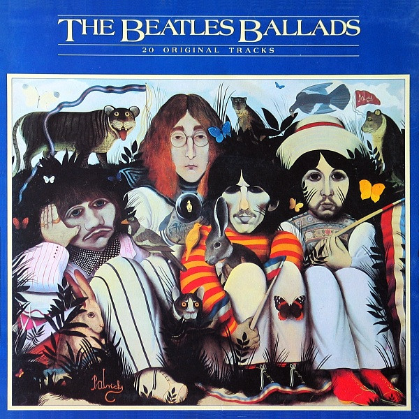

# The Beatles - The Beatles Ballads (1980)

## Ficha técnica

{width=30%, align=right}

 - **Artista**: The Beatles
 - **Álbum**: The Beatles Ballads
 - **Ano**: 1980
 - **Gêneros**: Rock
 - **Duração**: 57:28
 - **Gravadora**: Parlophone
 - **Produção**: George Martin, Phil Spector

## Faixas

| Nº|	Título	| Duração | Estado | Letra |
|:---:|:---|:---|:---|:---:|
| A1  | Yesterday                         | 2:02 | :fontawesome-solid-star: | [:octicons-note-16:](https://genius.com/The-beatles-yesterday-lyrics){target="_blank"}|
| A2  | Norwegian Wood                    | 2:01 | :fontawesome-solid-star: | [:octicons-note-16:](https://genius.com/The-beatles-norwegian-wood-this-bird-has-flown-lyrics){target="_blank"}|
| A3  | Do You Want To Know A Secret      | 1:55 | :fontawesome-solid-star: | [:octicons-note-16:](https://genius.com/The-beatles-do-you-want-to-know-a-secret-lyrics){target="_blank"}|
| A4  | For No One                        | 1:57 | :fontawesome-solid-star: | [:octicons-note-16:](https://genius.com/The-beatles-for-no-one-lyrics){target="_blank"}|
| A5  | Michelle                          | 2:40 | :fontawesome-solid-star: | [:octicons-note-16:](https://genius.com/The-beatles-michelle-lyrics){target="_blank"}|
| A6  | Nowhere Man                       | 2:41 | :fontawesome-solid-star: | [:octicons-note-16:](https://genius.com/The-beatles-nowhere-man-lyrics){target="_blank"}|
| A7  | You've Got To Hide Your Love Away | 2:06 | :fontawesome-solid-star: | [:octicons-note-16:](https://genius.com/The-beatles-youve-got-to-hide-your-love-away-lyrics){target="_blank"}|
| A8  | Across The Universe               | 3:43 | :fontawesome-solid-star: | [:octicons-note-16:](https://genius.com/The-beatles-across-the-universe-lyrics){target="_blank"}|
| A9  | All My Loving                     | 2:05 | :fontawesome-solid-star: | [:octicons-note-16:](https://genius.com/The-beatles-all-my-loving-lyrics){target="_blank"}|
| A10 | Hey Jude                          | 7:05 | :fontawesome-solid-star: | [:octicons-note-16:](https://genius.com/The-beatles-hey-jude-lyrics){target="_blank"}|
| B1  | Something                         | 2:59 | :fontawesome-solid-star: | [:octicons-note-16:](https://genius.com/The-beatles-something-lyrics){target="_blank"}|
| B2  | The Fool On The Hill              | 2:55 | :fontawesome-solid-star: | [:octicons-note-16:](https://genius.com/The-beatles-the-fool-on-the-hill-lyrics){target="_blank"}|
| B3  | Till There Was You                | 2:11 | :fontawesome-solid-star: | [:octicons-note-16:](https://genius.com/The-beatles-till-there-was-you-lyrics){target="_blank"}|
| B4  | The Long And Winding Road         | 3:35 | :fontawesome-solid-star: | [:octicons-note-16:](https://genius.com/The-beatles-the-long-and-winding-road-lyrics){target="_blank"}|
| B5  | Here Comes The Sun                | 3:03 | :fontawesome-solid-star: | [:octicons-note-16:](https://genius.com/The-beatles-here-comes-the-sun-lyrics){target="_blank"}|
| B6  | Blackbird                         | 2:19 | :fontawesome-solid-star: | [:octicons-note-16:](https://genius.com/The-beatles-blackbird-lyrics){target="_blank"}|
| B7  | And I Love Her                    | 2:28 | :fontawesome-solid-star: | [:octicons-note-16:](https://genius.com/The-beatles-and-i-love-her-lyrics){target="_blank"}|
| B8  | She's Leaving Home                | 3:35 | :fontawesome-solid-star: | [:octicons-note-16:](https://genius.com/The-beatles-shes-leaving-home-lyrics){target="_blank"}|
| B9  | Here, There And Everywhere        | 2:21 | :fontawesome-solid-star: | [:octicons-note-16:](https://genius.com/The-beatles-here-there-and-everywhere-lyrics){target="_blank"}|
| B10 | Let It Be                         | 3:47 | :fontawesome-solid-star-half-stroke: | [:octicons-note-16:](https://genius.com/The-beatles-let-it-be-lyrics){target="_blank"}|
